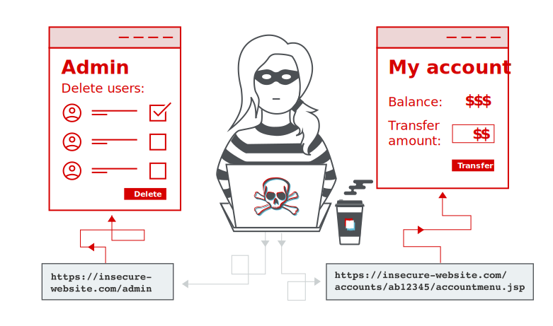

## Target Information
The target is a web application which will help the organization to track and pay their invoices, bills and other transactions. It's totally a business banking application.

## Recon
Post checking all the feature and i have figured out that the application is vulnerable to IDOR because the application performs the actions on APIs based on the input details that the application pass through the URL and in JSON Objects of the request body.

## Exploitation
I have exploited several endpoints to view and edit other organization's users invoices, able to access their transaction details and other bills.

Here comes the fun part that the application have a feature that you can add your bank accounts into the application and once the account is merged the application will provide you a virtual bank account which will be like **ABC Virtual Bank account** from **ABC Internet Bank**.

The application allow the users to add n-number of bank accounts to the **ABC Virtual Bank account** so in order to quickly find  the bank account details the application have a feature to rename the account name as any nicknames like the request below,

## Request
```text
PUT /connected_banking/12345
Host: app.abc.com

{
	"bankid": 12345,
	"account_nickname": thevillagehacker,
	"account_id": 1111,
	"company_id": 0000
}
````

## Response
```text
HTTP/2 200 OK
{
	"abc_account_id": 12345,
	"account_nickname": thevillagehacker,
	"account_id": 1111,
	"company_id": 0000,
	"current_balance": XXXX.XX
}
```
The above request shows that the application is using the details of the bank id from the URL and the JSON object in the request body. So by bruteforcing the `bankid` lead me to change the nicknames of other users bank account nickname.

And the IDOR didn't stopped right there, whenever i changed the nickname of users bank accounts those bank accounts were linked to my **ABC Virtual Bank account**. So now other users bank accounts are linked to me and i can access their bank account details, balances, transactions and etc,

Thank you for reading.

Follow me on Twitter : [thevillagehacker](https://twitter.com/thevillagehackr)