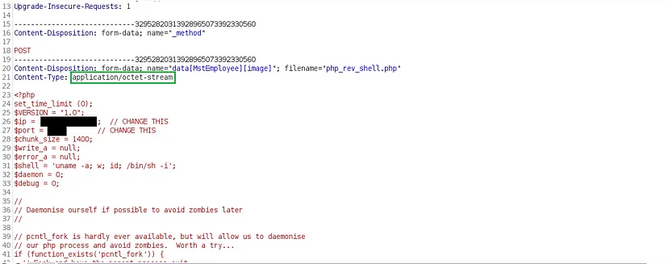

# Remote Code Execution
Remote code execution (RCE) refers to the ability of a cyber attacker to access and make changes to a computer owned by another, without authority and regardless of where the computer is geographically located. RCE allows an attacker to take over a computer or a server by running arbitrary malicious software (malware).

Found a target using google dorks which having a responsible disclosure program. Let’s consider the target as abc.com the target website has profile picture upload functionality. The developer configured the application not to accept other than whitelisted extensions as `*.gif, *.jpeg, *.png`.

So I quickly wanted to check the application how handles if I upload files other than whitelisted ones.

I uploaded the PHP file and observed that the application does not allow me to upload because of the validation present in the front end of the application.

Minutes later I decided to change the **Content-Type** to bypass the client-side validation. I changed the Content-Type from **application/octet-stream** to image/png and `image/jpg and image/jpeg` but no luck but I do had a thought about to changing the content type into **image/gif** to see how it parses the file.

Guess what the file successfully uploaded it seems the developer does not configure the content type and content of the uploaded files.

I forwarded the file upload request and observed the following request which had the location of the file that we uploaded. Now we uploaded the file and have the location of where it stores all we have to do is to trigger the reverse shell.

I quickly directed to the reverse_shell.php file location to trigger the reverse shell and all of the processes are correct but I didn’t have a reverse shell. And I finally found out that the server was configured to block outbound TCP connections.

So I was thinking about how to bypass that and something came up to my mind what if I create a shell inside the server and view it inside the server, so I used [powny shell](https://github.com/flozz/p0wny-shell/blob/master/shell.php) to create RCE.

I uploaded the powny shell exactly I have done to upload reverse shell before and got the file location on followed request. Directed to the file location and the RCE is finally got triggered.

## Takeaways
- Try changing content type while uploading restricted files.
- Check all the whitelisted file types that you can upload.
- If the server is configured to restrict outbound TCP connections try uploading a powny shell and trigger it which will create a web reverse shell inside the webserver.

Thank you for reading.

Follow me on Twitter : [thevillagehacker](https://twitter.com/thevillagehackr)