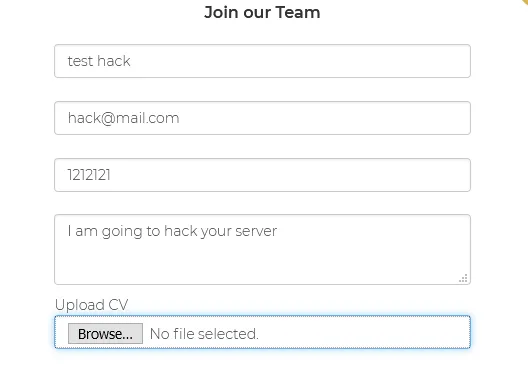
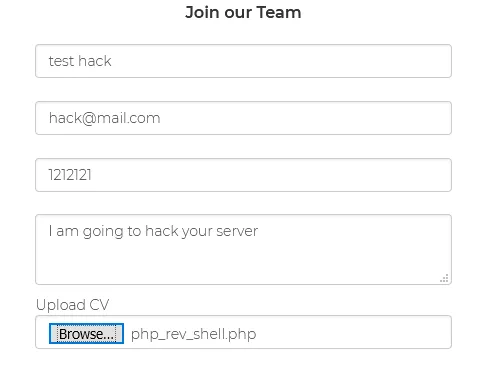
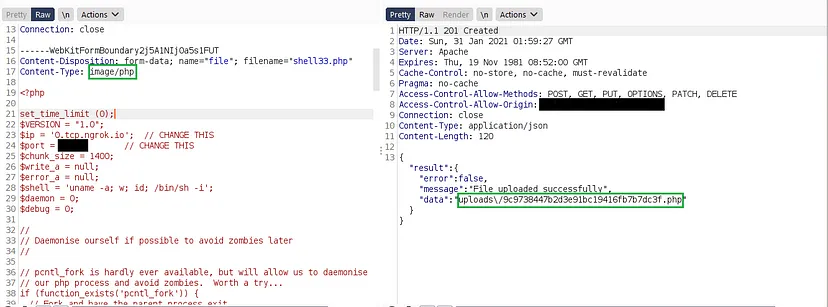
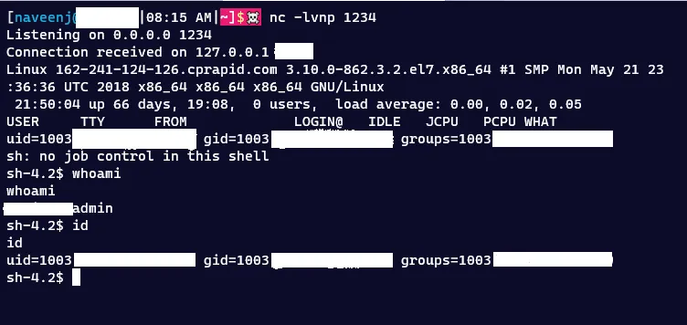

# Remote Code Execution
Remote code execution (RCE) refers to the ability of a cyber attacker to access and make changes to a computer owned by another, without authority and regardless of where the computer is geographically located. RCE allows an attacker to take over a computer or a server by running arbitrary malicious software (malware).

Found a target using google dorks which having a responsible disclosure program. Let’s consider the target as abc.com the target website have no functions other than uploading CV to the company.

## Find more Google Dorks
[GitHub Repo](https://github.com/thevillagehacker/Bug-Hunting/blob/main/Dorks/Google_dorks.md)

So I quickly filled out all the necessary details and attached [php reverse shell](https://github.com/thevillagehacker/Bug-Hunting/blob/main/Rev-shell/php_rev_shell.php) as attachment and uploaded.

Intercepted the request and checked does this function allow to upload php files and it turns yes. They don’t have any validations on file content types and file contents.

So I used ngrok for PORT forwarding to gain reverse shell. I updated the IP address and PORT from ngrok and uploaded the reverse shell successfully.

The website shown the location of the uploaded files in the response, so I quickly directed to the php file location and triggered the reverse shell and the objective is completed.

I Quickly reported the Issue to the respective company and they acknowledged the report, reproduced the issue, and rewarded me $500 for reporting the issue.

Thank you for reading.

Follow me on Twitter : [thevillagehacker](https://twitter.com/thevillagehackr)