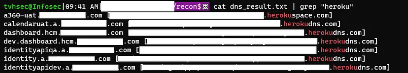
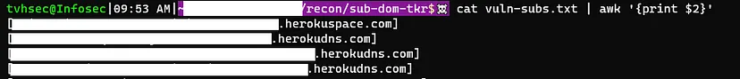
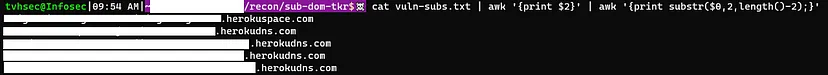
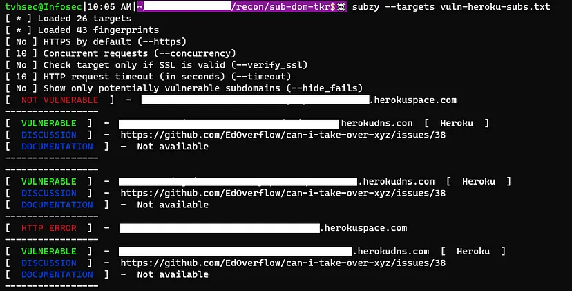
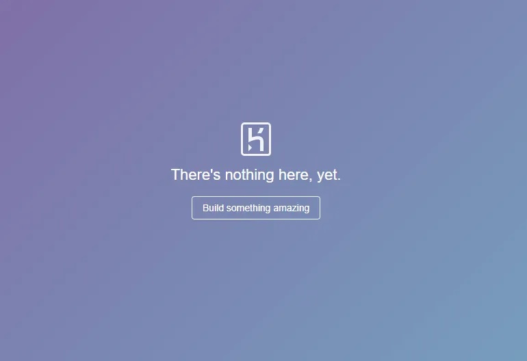
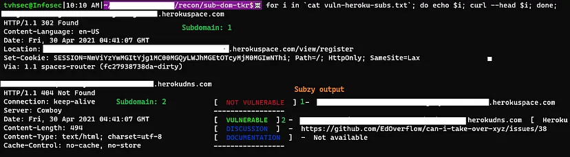

Hello all, It’s been a long time I hope everyone on planet earth is okay during this pandemic situation. Today I came up with a new writeup which is I found recently.

I mostly work on responsible disclosure because I thought I can help the companies who can’t afford the pen-testing services. So let’s get started, the program is a responsible disclosure program as I always do. let’s consider the target as abc.com and I started my recon as I always do. The target has 2000+ subdomains and I thought wow I am going to have a very big time working on this target.

So I thought let’s start with subdomain recons I used [dnsx](https://github.com/projectdiscovery/dnsx) to recon all the subdomains CNAME records. I luckily found out that the 20 + subdomain of the target having CNAME records pointing to [Heroku](https://www.heroku.com/) cloud services.

So I did my homework to takeover the subdomains and I found this good article [Subdomain Takeover: Identifying Providers](https://0xpatrik.com/subdomain-takeover-providers/). So I quickly wanted things to be done faster and I used the grep to filter the results that match “Heroku” and got 20+ subdomains.

**dnsx results**


We gotta filter the results to check if the subdomains are vulnerable or not. I quickly did this bash trick to filter out the results as below,

First I have to extract the Heroku subdomains from the results, due to the non-disclosure agreements I can’t disclose the targets.

`cat vuln-subs.txt | awk ‘{print $2}’`



Now we need to remove the open and close bracket present at the start and end of the line. Now this command will sort out our problem.

```sh
cat vuln-subs.txt | awk ‘{print $2}’ | awk ‘{print substr($0,2,length()-2);}’
```



Now we got everything to automate the process. Now I can run all those subdomains with [subzy](https://github.com/LukaSikic/subzy).



Not all of the subdomains are vulnerable to take over, those subdomains which are not having any apps deployed on them are vulnerable to take over.



So now I have to check if there are any apps deployed on those subdomains yet. So I quickly checked the response of those subdomains to verify that the apps are deployed or not by using curl.

```sh
for i in `cat vuln-heroku-subs.txt`; do echo $i; curl — head $i; done;
```



So as per my recon, it seems the subdomains with 404 response are vulnerable takeover, I cross verified those results with subzy results and came up with this conclusion.

I quickly created a good Proof of concept and reported to the respective company.

Thank you for reading.

Follow me on Twitter : [thevillagehacker](https://twitter.com/thevillagehackr)